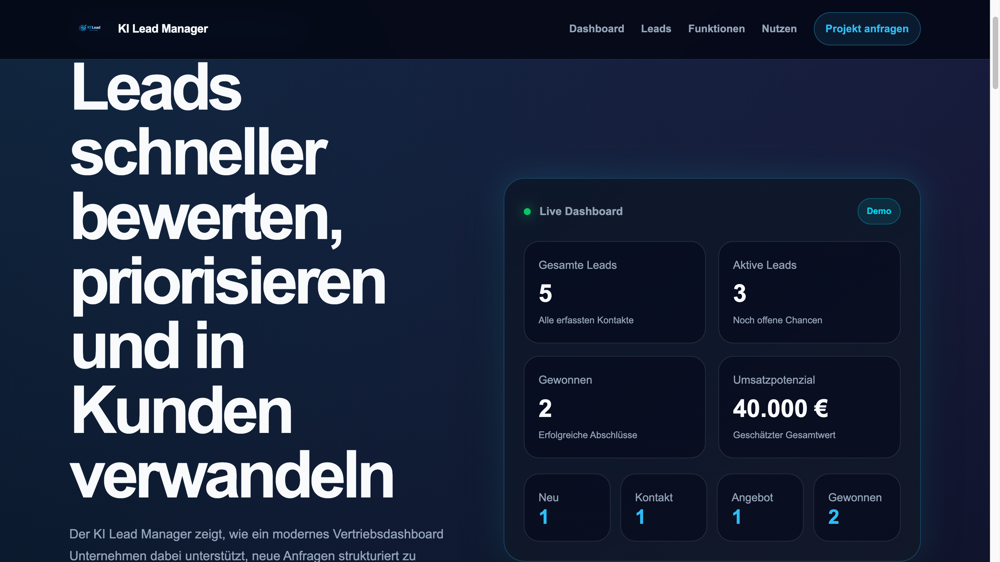
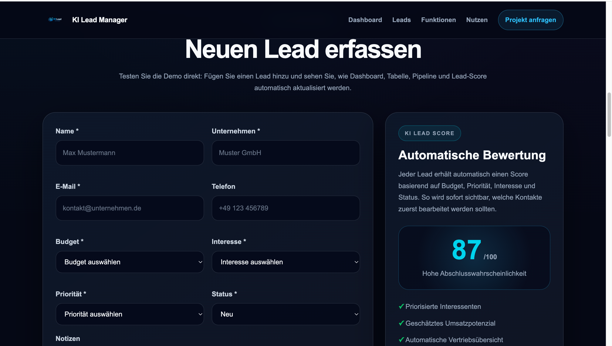
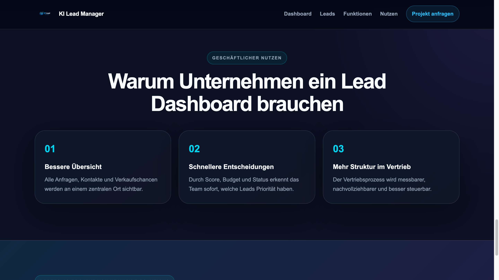

# 📊 KI Lead Manager

**KI Lead Manager** ist eine moderne Lead-Management- und Vertriebsdashboard-Demo, entwickelt von **Heaviside Solutions**. Die Anwendung zeigt, wie Unternehmen Leads erfassen, priorisieren, bewerten und ihren Vertriebsprozess effizienter gestalten können.

Die Demo kombiniert ein interaktives Dashboard, automatisches Lead-Scoring, Umsatzpotenzial-Berechnung und eine strukturierte Lead-Verwaltung in einer modernen SaaS-ähnlichen Benutzeroberfläche.

🌐 Website: https://heaviside-solutions.com  
🚀 Live Demo: https://heaviside479.github.io/ai-lead-manager-demo/

---

## 🚀 Live Demo

👉 Demo öffnen:

https://heaviside479.github.io/ai-lead-manager-demo/

---

## 🖼 Screenshots

### Dashboard Übersicht



### Lead-Erfassung



### Geschäftlicher Nutzen



---

## 🎯 Projektziel

Viele Unternehmen erhalten Kundenanfragen über verschiedene Kanäle:

- Kontaktformulare
- Landingpages
- E-Mails
- Empfehlungen
- Telefonanfragen

Ohne ein strukturiertes System gehen wichtige Informationen häufig verloren. Leads werden unterschiedlich bewertet, Follow-ups vergessen oder potenzielle Kunden zu spät kontaktiert.

Der KI Lead Manager demonstriert, wie ein digitales Lead-Management-System dabei helfen kann:

- Leads zentral zu erfassen
- Vertriebschancen sichtbar zu machen
- Interessenten automatisch zu priorisieren
- Umsatzpotenziale zu berechnen
- Vertriebsprozesse zu strukturieren
- Entscheidungen datenbasiert zu treffen

---

## ✨ Funktionen

### 📊 Live Dashboard

Das Dashboard aktualisiert sich automatisch und zeigt:

- gesamte Leads
- aktive Leads
- gewonnene Leads
- geschätztes Umsatzpotenzial
- Vertriebs-Pipeline

### 👥 Lead-Verwaltung

Leads können direkt im Browser angelegt und verwaltet werden:

- Name
- Unternehmen
- E-Mail
- Telefon
- Budget
- Interesse
- Priorität
- Status
- Notizen

### ⭐ Automatisches Lead Scoring

Jeder Lead erhält automatisch einen Score zwischen **0 und 100**.

Die Bewertung basiert auf:

- Budget
- Priorität
- Interesse
- Lead-Status

Dadurch werden besonders wertvolle Kontakte sofort sichtbar.

### 💾 Lokale Datenspeicherung

Die Anwendung verwendet **localStorage**, damit:

- neue Leads gespeichert bleiben
- Statusänderungen erhalten bleiben
- gelöschte Leads nicht wieder erscheinen
- Dashboard-Daten nach dem Neuladen bestehen bleiben

### 🔄 Demo-Daten zurücksetzen

Die Anwendung enthält vorbereitete Demo-Leads. Mit einem Klick kann die gesamte Demo jederzeit auf den ursprünglichen Zustand zurückgesetzt werden.

### 📱 Responsive Design

Der KI Lead Manager wurde vollständig responsive entwickelt und funktioniert auf:

- Desktop
- Laptop
- Tablet
- Smartphone

---

## 💼 Anwendungsbereiche

Ein vergleichbares Lead-Management-System kann eingesetzt werden für:

- Agenturen
- IT-Dienstleister
- Softwareunternehmen
- Beratungsunternehmen
- Immobilienunternehmen
- Handwerksbetriebe
- Vertriebsorganisationen
- Startups
- Dienstleistungsunternehmen

---

## 🛠 Verwendete Technologien

- HTML5
- CSS3
- Vanilla JavaScript
- localStorage
- Responsive Design
- GitHub Pages

---

## 🎨 Design-Fokus

Das Interface orientiert sich an modernen SaaS-, CRM- und Dashboard-Lösungen.

Inspirationen:

- HubSpot
- Salesforce
- Pipedrive
- Monday.com

Schwerpunkte:

- moderne Business-Software-Optik
- klare Benutzerführung
- hohe Lesbarkeit
- strukturierte Datenvisualisierung
- professionelle Dashboard-Darstellung

---

## 🧠 Was dieses Projekt demonstriert

Dieses Portfolio-Projekt zeigt:

- Frontend-Entwicklung mit HTML, CSS und JavaScript
- Dashboard-Design
- Lead-Management-Konzepte
- Datenvisualisierung
- benutzerfreundliche Formulare
- dynamische DOM-Manipulation
- automatische Lead-Bewertung
- browserbasierte Datenspeicherung
- responsive Webentwicklung

---

## 📂 Projektstruktur

```text
ai-lead-manager-demo/
│
├── index.html
├── style.css
├── script.js
├── README.md
│
├── assets/
│   └── logo.png
│
└── screenshots/
    ├── ai-lead-manager-dashboard-overview.png
    ├── ai-lead-manager-lead-form.png
    └── ai-lead-manager-business-benefits.png
